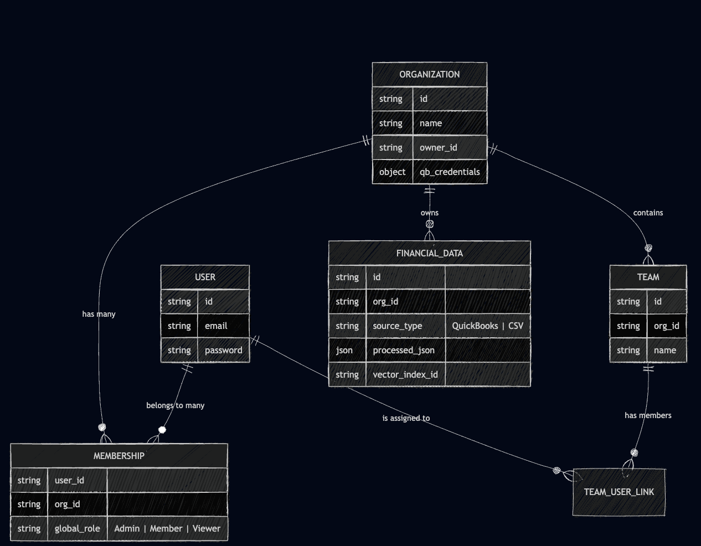
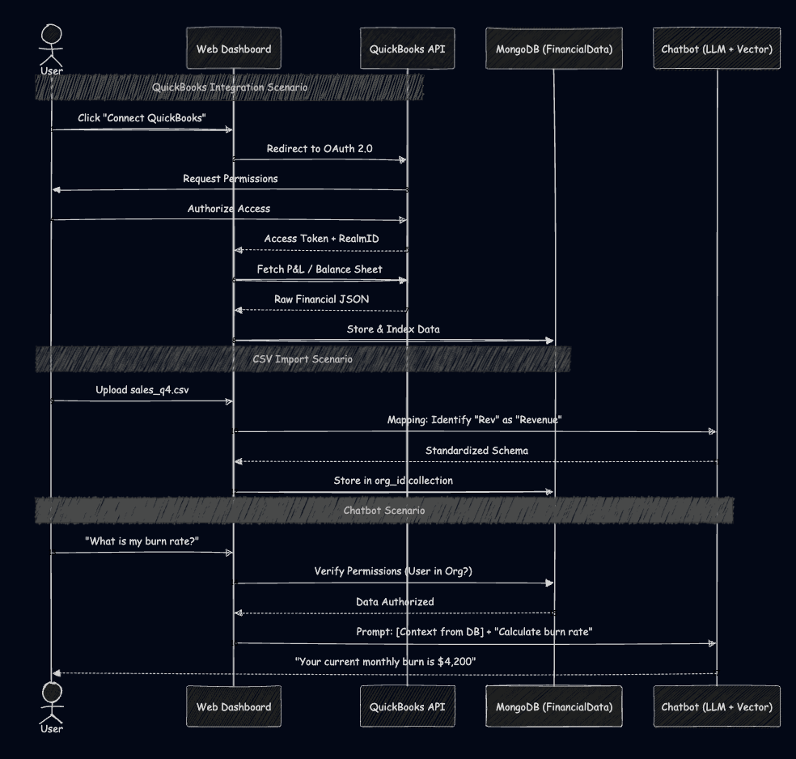
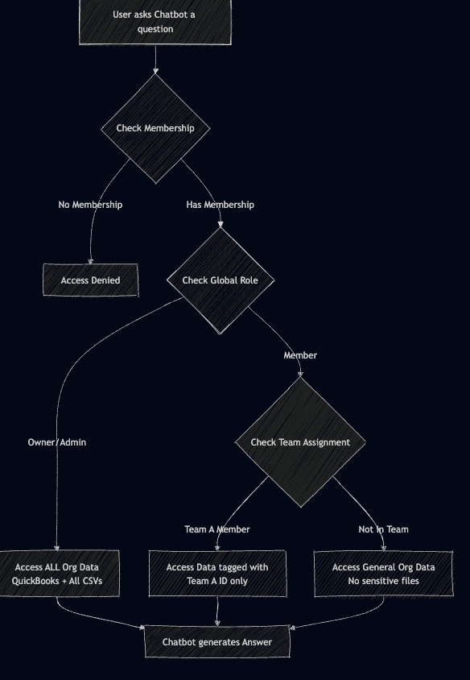

# Softcom'26

To make this clear for your development team, I have broken this down into three visual components using Mermaid syntax (which is standard for technical documentation).

### 1. The Architecture & Relationship Diagram
This diagram shows how **Organizations, Teams, and Members** relate to each other and where the **Data Sources** (QuickBooks/CSV) live.

---

### 2. The Integration & Chatbot Flow
This sequence diagram visualizes the two ways data enters the system and how the chatbot interacts with that data.

---

### 3. Permission & Access Control (RBAC) Logic
This flowchart explains how the system decides what a user can see when they interact with the Chatbot.

### Summary for the Team:

1.  **Multi-Tenancy:** The `Membership` collection is the "glue." It allows a User to have different roles in different Orgs. When a user logs in, they must "Select an Org" to set the context.
2.  **QuickBooks Integration:** We aren't storing the user's password; we are storing **OAuth Tokens** at the `Organization` level. This means once the Owner connects it, the Admin and authorized Members can query it.
3.  **CSV Import:** This isn't just a file upload; it's a **Data Injection**. We parse the CSV into JSON and store it in MongoDB so the Chatbot can "read" it like a database.
4.  **Permissions Logic:** 
    *   **Org Level:** Can you enter the building? (Membership)
    *   **Team Level:** Which rooms can you go into? (Team Assignment)
    *   **Role Level:** Can you change things or just look? (Admin vs. Viewer)

**Dev Tip:** When building the Chatbot, always include `orgId` and `teamId` in your MongoDB filter queries to prevent "Data Bleed" between different teams or organizations.